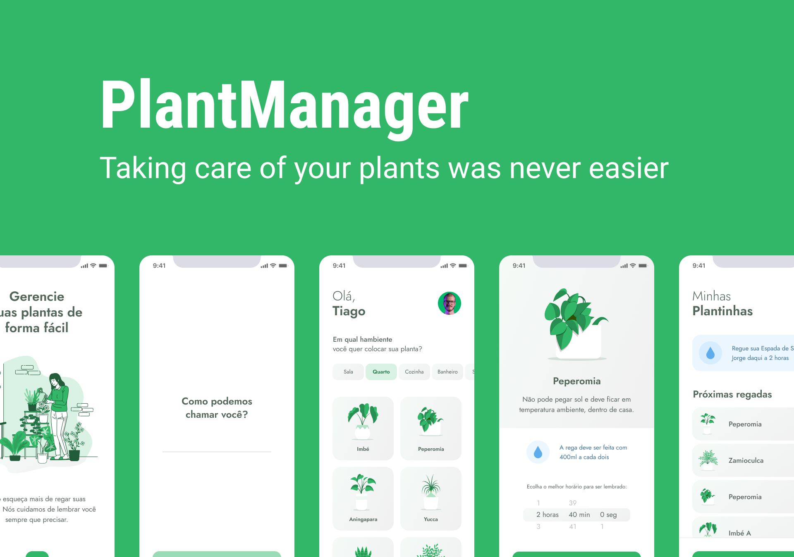

<h1 align="center">
  
</h1>

  <a href="#technologies">Technologies</a>&nbsp;&nbsp;&nbsp;|&nbsp;&nbsp;&nbsp;
  <a href="#project">Project</a>&nbsp;&nbsp;&nbsp;|&nbsp;&nbsp;&nbsp;
  <a href="#layout">Layout</a>&nbsp;&nbsp;&nbsp;|&nbsp;&nbsp;&nbsp;
  <a href="#usage">Usage</a>

<h1 align="center">
  
</h1>

## Technologies
This project used the following technologies:

- [React Native](https://reactnative.dev/)
- [TypeScript](https://www.typescriptlang.org/)
- [JSON Server](https://github.com/typicode/json-server)

## Project
PlantManager helps you taking care of your plants by reminding you to water them. The project was built during the [Next Level Week](https://rocketseat.com.br/) event.

## Layout
You can access the Figma template here: https://www.figma.com/file/4VcM5lisaePs1u5VKTCOFp/PlantManager?node-id=0%3A1 

## Usage
First run `yarn` to install the project's dependencies, then run `yarn server` to start the JSON Serve fake API. Finally, in another bash window, run `expo start` to run the project.